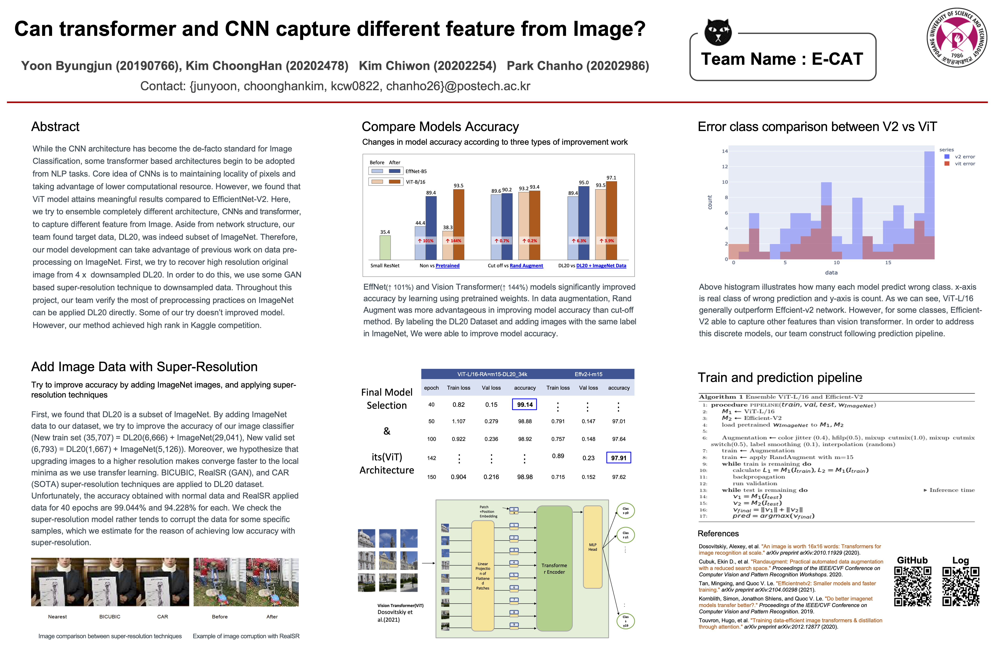

# CSED538-final-project

This is repo for CSED538/AIGS538 Deep learning final project. 
just do it

## Poster Presentation

## Report
If you are interested in our works, please refer to our [report](report)
## Training log
All training log to construcut final model is available in 

## Training script
Distributed Training script is written based on  package script. 
Since there are too many training script used in our local directory, we include argument config file for final model only. 
If other of them are required, please request to Byungjun Yoon <junyoon@postech.ac.kr>. 

## New Dataset
DL20_34k dataset that we used in our final project is now publicly available in kaggle dataset. 
